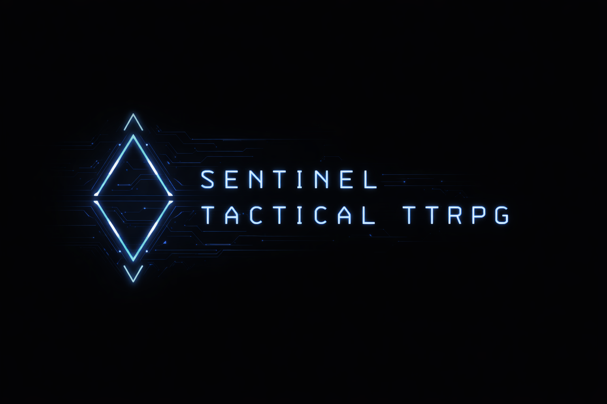

<p align="center">
  
</p>

# SENTINEL

[](https://github.com/KvFxKaido/SENTINEL/actions/workflows/ci.yml)
[](https://creativecommons.org/licenses/by-nc/4.0/)
[](https://github.com/sponsors/KvFxKaido)

**One universe. Several games.**

SENTINEL is a setting — post-collapse North America, eleven factions, no
villains, everyone right about something — and this repo is every game
being built inside it. A tabletop RPG run by an AI Game Master. A tactical
circuit game where surrender is a mechanic and mercy has a price. An edge
service that certifies match records like a notary. A 2.5D world taking
shape around all of it.

They share the lore, the factions, and one law borrowed from the Witnesses
faction itself: **what happened is on the record, and the record can be
replayed.** "We remember so you don't have to lie" is a faction motto in
the fiction and an engineering doctrine in the code — golden transcripts
that pin the rules as behavior, match records that replay byte-for-byte,
a content-addressed archive nothing enters without proving itself.

## What's in the box

| Piece | What it is | Status |
|-------|-----------|--------|
| [Tabletop RPG + AI GM](#the-tabletop-rpg) | The full RPG, run by an AI Game Master on local LLMs | **Playable** — 450+ tests |
| [The Circuit](#the-circuit--tactical-combat-as-an-institution) | Tactical combat as a broadcast institution | **Playable prototype** (browser) |
| [The Witness](#the-witness--records-at-the-edge) | Match certification + archive at the edge | **Live** on Cloudflare Workers |
| [The world game](#where-its-heading) | The universe as a playable 2.5D place | **Direction** — pieces prototyped |

## The Universe

**Core loop:** Investigation → Interpretation → Choice → Consequence

Not about min-max optimization, combat dominance, or binary morality.
About navigating competing truths, sustaining integrity under pressure,
relationships as resources, and choosing consequences you can live with.

### The Eleven Factions

| Faction | Philosophy |
|---------|------------|
| **Nexus** | The network that watches |
| **Ember Colonies** | We survived. We endure. |
| **Lattice** | We keep the lights on |
| **Convergence** | Become what you were meant to be |
| **Covenant** | We hold the line |
| **Wanderers** | The road remembers |
| **Cultivators** | From the soil, we rise |
| **Steel Syndicate** | Everything has a price |
| **Witnesses** | We remember so you don't have to lie |
| **Architects** | We built this world |
| **Ghost Networks** | We were never here |

### Geography

Post-collapse North America, fractured along infrastructure lines.

| Region | Primary Faction | Contested By |
|--------|-----------------|--------------|
| Rust Corridor | Lattice | Steel Syndicate |
| Appalachian Hollows | Ember Colonies | Cultivators |
| Gulf Passage | Wanderers | Ghost Networks |
| Breadbasket | Cultivators | Wanderers |
| Northern Reaches | Covenant | Ember Colonies |
| Pacific Corridor | Convergence | Architects |
| Desert Sprawl | Ghost Networks | Steel Syndicate |
| Northeast Scar | Architects | Nexus |
| Sovereign South | Witnesses | Covenant |
| Texas Spine | Steel Syndicate | Lattice |
| Frozen Edge | Ember Colonies | — |

Nexus holds no territory — they hold information. Their presence is
everywhere infrastructure exists.

The canon lives in [`lore/`](lore/) (novellas — Act 1: *Becoming*
complete) and [`wiki/`](wiki/) (an Obsidian reference vault, indexed for
retrieval by everything else in this repo).

---

## The Tabletop RPG

A tactical, relationship-driven tabletop RPG with an AI Game Master.
Complete rules in [`core/`](core/), engine in
[`sentinel-agent/`](sentinel-agent/), faction knowledge served over MCP by
[`sentinel-campaign/`](sentinel-campaign/).

### Quick Start

```bash
cd sentinel-agent
pip install -e .
sentinel                       # Textual TUI (recommended)
sentinel-cli                   # Dev CLI with simulation
```

**For 8B-12B models:** Add `--local` for optimized context budgets.

Then: `/new` → `/char` → `/start` → play

### Commands at a Glance

| Command | What it does |
|---------|--------------|
| `/consult <question>` | Get competing perspectives from faction advisors |
| `/factions` | View standings, relationships, cascade effects |
| `/npc [name]` | View NPC info and personal history |
| `/arc` | Manage emergent character arcs |
| `/consequences` | View pending threads and avoided situations |
| `/wiki [page]` | View campaign timeline or page overlay |
| `/compare` | Cross-campaign analysis (faction divergence, hinges) |
| `/timeline <query>` | Search campaign memory (requires memvid) |
| `/simulate preview <action>` | Preview consequences without committing |
| `/lore quotes` | Browse faction mottos and world truths |
| `/region` | View current region, travel between regions |
| `/favor <npc> <type>` | Call in a favor from an allied NPC |
| `/shop` | Browse and buy gear + vehicles |
| `/jobs` | View and accept faction jobs |
| `/debrief` | End session with reflection prompts |

### Character Backgrounds

Players choose one professional background. Backgrounds express
capability, not destiny.

* **Intel Operative** — Systems analysis, surveillance, pattern recognition
* **Medic / Field Surgeon** — Triage, biology, crisis care
* **Engineer / Technician** — Repair, infrastructure, hacking
* **Negotiator / Diplomat** — Persuasion, mediation, languages
* **Scavenger / Salvager** — Resource location, improvisation, barter
* **Combat Specialist** — Tactics, firearms, physical conditioning

### Faction Affiliation

Players choose starting relationships, not membership. You're not "in" a
faction — you have standing with them.

* **Aligned** — Start Friendly with one faction, Unfriendly with its opposite
* **Neutral** — Start Neutral with all factions; harder early, flexible long-term

### Key Features

**AI Game Master** — Local backends (LM Studio, Ollama), hot-reloadable
prompts with phase-specific guidance, lore retrieval from novellas +
campaign memory search, `/consult` for competing faction perspectives,
`/simulate` to preview consequences without committing.

**NPC System** — Agendas (wants, fears, leverage, owes, lie_to_self),
individual memory separate from faction standing, memory triggers that
react to player actions, disposition modifiers that change behavior per
level.

**Faction Dynamics** — 11 factions with inter-faction relationships,
cascading effects when you help or oppose factions, faction narrative
corruption (GM language shifts with standing).

**Consequence Engine** — Hinge moments (irreversible choices), dormant
threads (delayed consequences), leverage escalation (factions call in
favors with deadlines), avoidance tracking (not acting is also a choice).

**Character Development** — 8 emergent arc types detected from play
patterns; accepted arcs inform GM behavior and NPC recognition. Social
energy with personalized restorers and drains.

**Campaign Memory** ([Memvid](https://github.com/memvid/memvid)) —
Semantic search over campaign history; auto-captures hinges, faction
shifts, NPC interactions. Optional dependency — works without it.

**Geography & Vehicles** — 11 world regions with faction control and
adjacency, purchasable vehicles whose tags unlock job types (cargo,
extraction, stealth).

**Favor System** — Call in favors from allied NPCs (5 types: ride, intel,
gear_loan, introduction, safe_house). Dual-cost: limited tokens plus
standing.

**Wiki Integration (Obsidian)** — The game writes a campaign wiki as you
play: live game log, session summaries on `/debrief`, NPC pages created on
first encounter, auto-updated MOC indexes, bi-directional sync (edit NPC
disposition in Obsidian → game state updates), Dataview-ready frontmatter,
canvas support for thread management.

### LLM Backends

SENTINEL runs on local LLM backends. Hosted-API support is planned as a
follow-up.

| Backend | Setup |
|---------|-------|
| **LM Studio** | Download app, load model, start server (port 1234) |
| **Ollama** | `ollama pull llama3.2` — runs automatically (port 11434) |

The agent auto-detects available backends (LM Studio → Ollama). Use
`/backend <name>` to switch manually (`lmstudio`, `ollama`, `auto`).

Local mode (`--local`) reduces context from ~13K to ~5K tokens with
condensed prompts and phase-relevant tools only — 8B-12B models stay
focused and responsive.

| Requirement | Minimum | Recommended |
|-------------|---------|-------------|
| **Context window** | 8K tokens | 16K+ tokens |
| **VRAM (local)** | 8GB | 16GB+ |

### Tested Models

| Model | VRAM | Best For | Failure Mode |
|-------|------|----------|--------------|
| **Gemma 3** | ~12GB (27B) | Long-form continuity, dialogue-heavy sessions | Plays it safe under pressure |
| **GPT-OSS** | ~10GB (20B) | Auditability, constraint experiments | Flat prose, mechanical pacing |
| **Qwen 3** | ~8GB (14B) | System-heavy play | Scaffolding becomes the game |
| **Llama 3.2** | ~5GB (8B) | Low-end rigs (use `--local`) | Forgets state without local mode |
| **Ministral 3** | ~8GB (14B) | Deterministic GM logic, trigger-heavy systems | Over-follows rules, rigid |

#### The Governability Curve

Compliance with GM constraints doesn't scale linearly with model size.

| Size | Nickname | Behavior | Risk |
|------|----------|----------|------|
| <7B | Goldfish | Eager but forgets constraints as context grows | Drift |
| 8B–14B | Soldier | Follows literal instructions without "improving" them | **Ideal** |
| 20B–70B | Midwit | Detects conflict between constraints and training, invents workarounds | Disobedience |
| >70B | Academic | Can respect constraints but often requires heavy framing | Overhead |

For GM work, **obedience > reasoning**. A model that cannot stop talking
cannot listen.

---

## The Circuit — tactical combat as an institution

In this universe, tactical combat isn't a dungeon encounter — it's
**sanctioned, broadcast, and scored**. Matches have venues, hosts, stakes,
and an audience. Fighters kneel when their morale breaks, and what you do
next is watched. Design doc:
[`architecture/sentinel_circuit_design.md`](architecture/sentinel_circuit_design.md).

### Play it

```bash
python -m http.server 8080          # from the repo root
# → http://localhost:8080/prototypes/tactical3d/
```

Two renderers, one rules module ([`prototypes/`](prototypes/)):
[`tactical/`](prototypes/tactical/) is 2D canvas,
[`tactical3d/`](prototypes/tactical3d/) is 2.5D three.js — voxel-extruded
terrain, hand-authored pixel-sprite fighters, a CRT display pipeline,
because you are literally watching the feed.

### What's actually in it

- **Yield states** — hostiles fight for a purse, not a cause. Break their
  morale and they kneel; the match holds for the spare/finish call. An
  execution is a choice, not a roll, and the yard sees it.
- **The rating meter** — the crowd pays the purse, win or lose. Flash
  builds it, turtling bleeds it, blood is content — including yours.
  Playing to the crowd versus keeping your people safe is the named loop.
- **THE CARD** — pre-match framing: venue, stakes, the presence list (who
  can read you), tale of the tape. Post-match: the ledger, consequence
  prose, and the witness record.
- **Showrunner twists** — the house is a second actor with one verb and
  no dice. Cards announce on the feed a round before they land. First
  card: MERCY ODDS — the house replaces the spare payout with a bounty.
  Settled law: *the house can monetize your decision; it cannot decide
  what the decision means.*
- **The witness record** — `seed + input log` IS the match. Every
  committed command records; replaying a record re-records it, so a
  faithful replay reproduces its own input. That closure is the integrity
  check.

The rules live in [`prototypes/tactical-core/`](prototypes/tactical-core/)
— no DOM, no clock, no `Math.random`, every draw from a seeded stream.
The same module runs in the browser, under `node --test`, and at the edge:
**same bytes in all three**. Golden transcripts captured before the rules
were even extracted still pass, and five rules changes in a row have
landed without touching them — determinism as a test, not a habit.

```bash
cd prototypes/tactical-core && node --test    # 43 tests, the goldens among them
```

## The Witness — records at the edge

[`workers/witness/`](workers/witness/) is a Cloudflare Worker that imports
the exact rules module above and serves it as infrastructure. Live at
`https://sentinel-witness.ishawnd.workers.dev`.

```
GET  /replay?seed=deadbeef    the no-input playout — the goldens, from the edge
POST /certify                 a played match: replays the record, attests the transcript
POST /file                    certify AND archive — content-addressed, idempotent
GET  /matches                 the archive, newest first
```

A certificate attests that a record is a valid match under the stamped
rules version and that this transcript is its one true replay. Records
that don't replay, don't certify — tampering fails closed. The rules
version is itself expressed as behavior (a fingerprint of golden playouts,
outcomes included), so history can never be silently reinterpreted by
newer rules. The tactical prototype files matches here straight from the
post-match card.

Identity and provenance (who *played* a record) don't exist yet — the
archive is self-attested but replay-verified, and honest about exactly
that.

## Where it's heading

The endgame is the universe as a **playable place**: overworld, interiors,
and Circuit matches as connected 2.5D dioramas — voxel-extruded pixel art
staged in the void, running on phones. The tactical prototype's renderer
is the first room of that world.

The art direction is settled enough to build against: **cyberpunk meets
Dune** — the world is desaturated matter, only the broadcast glows.
Photoreal portrait sources are graded into two diegetic registers (the
feed and the terminal) rather than shown raw; pixel sprites carry the
bodies; every glowing surface is a screen somebody owns. See
[`architecture/art_direction_gba_tactics.md`](architecture/art_direction_gba_tactics.md)
and [`architecture/art_style_audit.md`](architecture/art_style_audit.md).

The platform direction is Cloudflare-first (the witness Worker is its
hello-world): web as the primary target, wrapped native later, with the
campaign brain moving to TypeScript so one language runs the browser, the
tests, and the edge. The AI GM above is the design laboratory for what
that campaign brain has to become.

---

## Project Structure

```
SENTINEL/
├── core/               # The tabletop game rules
├── sentinel-agent/     # AI Game Master (Python, local LLMs)
├── sentinel-campaign/  # Faction MCP server
├── lore/               # Canon novellas (RAG-retrievable)
├── wiki/               # Reference encyclopedia (Obsidian vault)
├── prototypes/         # The Circuit, playable
│   ├── tactical-core/  #   deterministic rules module + golden transcripts
│   ├── tactical/       #   2D canvas renderer
│   └── tactical3d/     #   2.5D three.js renderer (voxels, sprites, CRT)
├── workers/
│   └── witness/        # Edge certification + the match archive (live)
├── architecture/       # Design + decision docs (each carries a Status: line)
├── assets/             # Portraits, sprites, visual house style
└── scripts/            # Tooling (portrait grading, etc.)
```

## Development

```bash
# the tabletop engine
cd sentinel-agent && pip install -e ".[dev]" && pytest    # 450+ tests

# the tactical rules
cd prototypes/tactical-core && node --test                # 43 tests, goldens included

# the witness worker
cd workers/witness
pnpm dlx wrangler dev --port 8787                         # local
node witness_check.mjs                                    # the acceptance checks
```

CI runs all three on every push.

## Design Philosophy

> "The agent is a storyteller who knows the rules, not a rules engine
> that tells stories."

* NPCs are people, not obstacles
* Consequences bloom over time
* Honor player choices — no "right answers"
* Every faction is right about something
* Refusal is a meaningful choice
* Avoidance is content — the world doesn't wait
* Shared state must be visible — if you can't tell what changed, the
  system is hiding something
* Nothing is real unless it's on the record

## Documentation

| Document | Purpose |
|----------|---------|
| [Core Rules](core/) | The complete tabletop game |
| [Circuit Design](architecture/sentinel_circuit_design.md) | Combat as an institution |
| [Tactical Core](prototypes/tactical-core/README.md) | The rules module + golden-transcript discipline |
| [The Witness](workers/witness/README.md) | Edge certification of match records |
| [Art Direction](architecture/art_direction_gba_tactics.md) | Sprites, voxels, and the diorama stage |
| [Agent Architecture](architecture/AGENT_ARCHITECTURE.md) | AI GM technical design |
| [Mechanics Stack](architecture/MECHANICS_STACK.md) | How the RPG systems interconnect |
| [Campaign MCP Server](sentinel-campaign/README.md) | Faction server design |

## License

CC BY-NC 4.0
