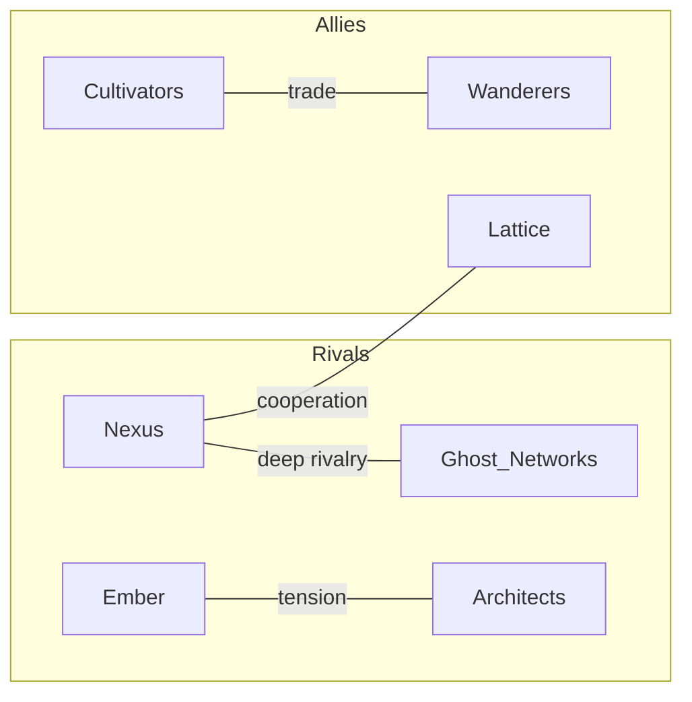

# Obsidian Integration Roadmap

*Enhancing the wiki with Obsidian-native features*

## Overview

The wiki (`wiki/`) serves as the reference encyclopedia for SENTINEL lore. These enhancements leverage Obsidian-specific features to improve navigation, visualization, and campaign tracking.

---

## Phase 1: Markdown Enhancements (No Code Changes)

### Callout Blocks for Mechanics
- [x] Define callout types for game events
- [x] Add callouts to existing wiki pages where relevant
- [x] Document callout conventions in wiki README

**Callout Types:**
```markdown
> [!hinge] Title
> Irreversible choice with consequences

> [!faction] Faction Standing Change
> From → To (±delta)

> [!thread] Dormant Thread
> Trigger condition and consequence

> [!npc] NPC Interaction
> Disposition change, memories formed

> [!intel] Intelligence
> Faction-specific knowledge
```

**Example Usage:**
```markdown
> [!hinge] Betrayed Nexus Contact
> Standing: Neutral → Unfriendly (-20)
> Thread queued: Nexus Retaliation
```

### Mermaid Faction Relationships
- [x] Add relationship diagram to Factions.md hub
- [x] Add mini-diagrams to individual faction pages (allies/rivals)
- [x] Include diagram legend

**Example:**


---

## Phase 2: Campaign Integration (Code Changes)

### Daily Notes from Debrief
- [x] Modify `/debrief` to generate daily note in `wiki/campaigns/{id}/sessions/`
- [x] Format: `YYYY-MM-DD.md` with session number in frontmatter
- [x] Include links to NPCs, factions, locations mentioned
- [x] Auto-generate wikilinks from entity names

**Template:**
```markdown
---
session: 5
date: 2026-01-11
campaign: iron_winter
---

# Session 5 — January 11, 2026

## Events
- [[Cipher]] revealed [[Nexus]] surveillance network
- Player chose to warn [[Ember Colonies]]

## Hinges
> [!hinge] Warned Ember About Surveillance
> [[Nexus]] standing: -10
> Thread: [[Nexus Suspicion]]

## NPCs Encountered
- [[Cipher]] (Nexus) — disposition: neutral → wary
- [[Elder Kara]] (Ember) — disposition: warm

## Next Session
- Dormant thread "Nexus Suspicion" may trigger
- [[Elder Kara]] owes a favor
```

### Frontmatter Structure for Dataview
- [x] Define frontmatter schema for NPCs, factions, events
- [x] Update existing wiki pages with structured frontmatter
- [x] Create example Dataview queries (see `canon/Dataview Queries.md`)

**NPC Frontmatter:**
```yaml
---
type: npc
name: Cipher
faction: Nexus
disposition: neutral
last_session: 5
tags: [analyst, contact, nexus]
---
```

**Faction Frontmatter:**
```yaml
---
type: faction
name: Nexus
standing: Friendly
standing_value: 20
last_shift: session 5
---
```

---

## Phase 3: Visual Management (New Features)

### Dataview Dashboards
- [x] Create `dashboards/` folder in wiki
- [x] NPC tracker: recent interactions, disposition
- [x] Thread tracker: active dormant threads by urgency
- [x] Faction overview: standings across campaigns

**Example Queries:**
```dataview
TABLE disposition, faction, last_session
FROM "campaigns/iron_winter/npcs"
SORT last_session DESC
LIMIT 10
```

```dataview
LIST
FROM "campaigns/iron_winter"
WHERE contains(tags, "hinge")
SORT date DESC
```

### Canvas for Active Threads
- [x] Create `threads.canvas` template
- [x] Position cards by urgency (left=soon, right=distant)
- [x] Color-code by faction
- [x] Link to trigger conditions
- [x] Archive zone for resolved threads

**Structure:**
```
┌─────────────────────────────────────────────────────┐
│  URGENT          SOON           DISTANT    RESOLVED │
│  ┌─────┐        ┌─────┐        ┌─────┐    ┌─────┐  │
│  │Nexus│        │Ember│        │Ghost│    │Done │  │
│  │Retri│        │Debt │        │Watch│    │     │  │
│  └─────┘        └─────┘        └─────┘    └─────┘  │
└─────────────────────────────────────────────────────┘
```

---

## Phase 4: Automation (Advanced)

### Auto-Update from Agent Events
- [x] Hook into event queue to update wiki on faction shifts
- [x] Auto-create NPC pages on first encounter
- [x] Update frontmatter when disposition changes
- [x] Append to daily note during session (live updates)

**Implementation:**
- `WikiAdapter.save_*` methods now call `append_to_session_note()` for real-time updates
- NPC pages created in `wiki/campaigns/{id}/NPCs/` with faction wikilinks
- Manager hooks trigger wiki updates on NPC interactions, hinge moments, thread events
- Session notes build incrementally during play, finalized at `/debrief`

### Graph View Optimization (Optional)
- [ ] Tag structure for meaningful clusters
- [ ] Faction colors in graph (via CSS snippets)
- [ ] Filter presets for campaign-specific views

*Note: Graph optimization requires manual Obsidian CSS configuration*

### Hardening (Council Review)
- [x] Atomic writes — write to temp file, then rename to prevent corruption
- [x] Write queue — serialize wiki updates via threading lock
- [x] Event IDs — idempotent appends via content hash (`<!-- eid:xxx -->`)
- [x] Error buffering — failed writes queued for retry on next operation

*Note: Full hardening complete. `flush_buffer()` available for forced retry at session end.*

---

## Phase 5: Advanced Integration (Future)

### Template Engine
- [x] User-customizable templates for auto-generated pages (NPC, session, etc.)
- [x] Jinja2 or simple string replacement for layouts
- [x] Template location: `wiki/templates/` with fallback defaults

**Implementation:**
- `src/state/templates.py`: TemplateEngine class with WikiTemplateLoader
- Built-in default templates: npc, session, callouts (hinge/faction/thread)
- Custom Jinja2 filters: `wikilink`, `npc_link`, `upper`
- User templates override defaults when placed in `wiki/templates/`

### Bi-Directional Sync
- [x] Watch wiki files for frontmatter changes
- [x] Reload game state when user edits NPC disposition, faction standing, etc.
- [x] Conflict resolution: game state vs wiki edits

**Implementation:**
- `src/state/wiki_watcher.py`: WikiWatcher class with watchdog file monitoring
- Parses YAML frontmatter, syncs NPC disposition/faction and faction standings
- Conflict resolution via file mtime vs `campaign.saved_at`
- Integrated into CampaignManager lifecycle (start/stop watching)

### Content Separation
- [x] Game log as separate file (`_game_log.md`) transcluded into session note
- [x] Keeps user's writing space separate from automated output
- [x] Reduces file conflict risk when user edits during play

**Implementation:**
- Session structure: `sessions/{date}/{date}.md` + `_game_log.md`
- Live updates go to `_game_log.md`, session summary to main note
- Obsidian transclusion: `![[_game_log]]`

### Static Navigation (MOCs)
- [x] Map of Content pages for resilient navigation without Dataview
- [x] Auto-generate index pages for NPCs, factions, sessions
- [x] Update MOCs on /debrief

**Implementation:**
- `_generate_mocs()` called from `save_session_summary()`
- Creates: `_index.md`, `NPCs/_index.md`, `sessions/_index.md`
- Templates: `moc_campaign.md.j2`, `moc_npcs.md.j2`, `moc_sessions.md.j2`

---

## Dependencies

| Feature | Requires |
|---------|----------|
| Callouts | Obsidian core (built-in) |
| Mermaid | Obsidian core (built-in) |
| Daily Notes | Code changes to `/debrief` |
| Dataview | Dataview plugin |
| Canvas | Obsidian core (built-in) |
| Auto-update | Event queue hooks |
| Hardening | Refactor WikiAdapter |
| Templates | Jinja2 (added as dependency) ✓ |
| Bi-directional | watchdog (added as dependency) ✓ |
| MOCs | Template engine + /debrief hook ✓ |

---

## Priority Recommendation

1. **Callouts + Mermaid** — Immediate visual improvement, no code ✓
2. **Daily Notes from Debrief** — Ties wiki to gameplay loop ✓
3. **Frontmatter + Dataview** — Enables powerful queries ✓
4. **Canvas** — Visual thread management ✓
5. **Auto-update** — Full integration ✓
6. **Hardening** — Atomic writes, write queue (before heavy use) ✓
7. **Templates** — User-customizable page layouts ✓
8. **Bi-directional sync** — Wiki edits update game state ✓

---

## Status: COMPLETE

All phases of Obsidian integration have been implemented. The wiki system now provides:
- Full markdown rendering with callouts, Mermaid diagrams, and wikilinks
- Live session updates during play
- Auto-generated NPC, faction, and session pages
- Content separation (game log vs user notes)
- Static navigation via MOCs
- Bi-directional sync for frontmatter edits
- User-customizable templates

---

## Notes

- All wiki content should work without plugins (graceful degradation)
- Dataview queries are optional enhancement, not required
- Canvas files are JSON-based, can be generated programmatically
- Mermaid renders in GitHub too, not just Obsidian
