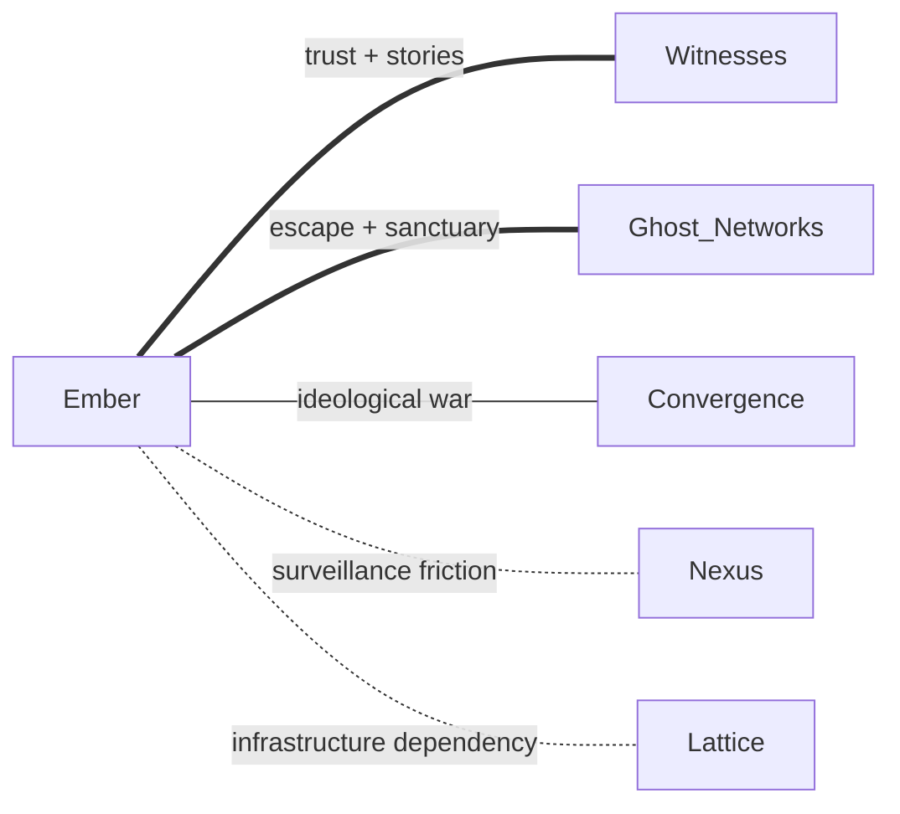

# Ember Colonies

> [!abstract] Core Philosophy
> **Autonomy at any cost.** Independence is survival. Trust is earned, not given.

---

## Overview

The Ember Colonies remember [[The Collapse]] viscerally. They survived by being small, hard to find, and harder to control. Outsiders earn trust slowly—or not at all.

These insular survivor settlements formed in places where geography itself provides defense: mountain hollers, frozen frontiers, and anywhere the old world's infrastructure couldn't reach them.

---

## Territory

### Primary Holdings

- [[Appalachian Hollows]] — Mountain communities from Georgia to Pennsylvania
- [[Frozen Edge]] — Alaska and Yukon, the last true frontier

### Zones of Influence

- [[Northern Reaches]] — Ember survivors drift north when the south gets too hot

### Borders

- **Hard borders:** Mountain passes, fortified hollers, geography itself
- **Philosophy:** If you can't find them, you can't control them

---

## Philosophy

> [!quote] Ember Principle
> "The last thing we trusted was each other. Then the sky caught fire."

**Legitimate fear:** Dependency becomes vulnerability
**Catastrophic blind spot:** Isolation becomes weakness; self-sufficiency becomes stagnation

### What They Get Right

- Small communities weather disasters better
- Independence prevents cascade failures
- Local knowledge outperforms centralized planning

### Where They Go Wrong

- Refusing all help means refusing survival sometimes
- Isolation breeds paranoia
- "We don't need anyone" becomes "We can't trust anyone"

---

## Relations

| Faction | Standing | Notes |
|---------|----------|-------|
| [[Cultivators]] | Friendly | Trade seeds and remedies along the ridgelines |
| [[Covenant]] | Contested | Clash in [[Northern Reaches]]; different visions of community |
| [[Lattice]] | Hostile | Enhancement represents everything Ember fears |
| [[Wanderers]] | Tolerant | Respect for self-reliance; occasional trade |

---

## Culture

- **Oral histories** passed through generations
- **Self-sufficiency** as moral imperative
- **Distrust of technology** beyond what they can maintain themselves
- **Community defense** drills and escape routes

---

## Notable Characteristics

- Fortified settlements with multiple fallback positions
- Expertise in pre-industrial survival skills
- Networks of hidden caches and safe houses
- Generational trauma shaping policy

---

## Story Hooks

- An Ember settlement needs outside help but won't ask for it
- A young Ember wants to leave; their family considers it betrayal
- Something is attacking isolated settlements—coordinated, methodical

---

## See Also

- [[Factions]] — Overview of all eleven factions
- [[Appalachian Hollows]] — Primary territory
- [[Frozen Edge]] — Remote northern holdings
- [[The Collapse]] — The trauma that shaped them
