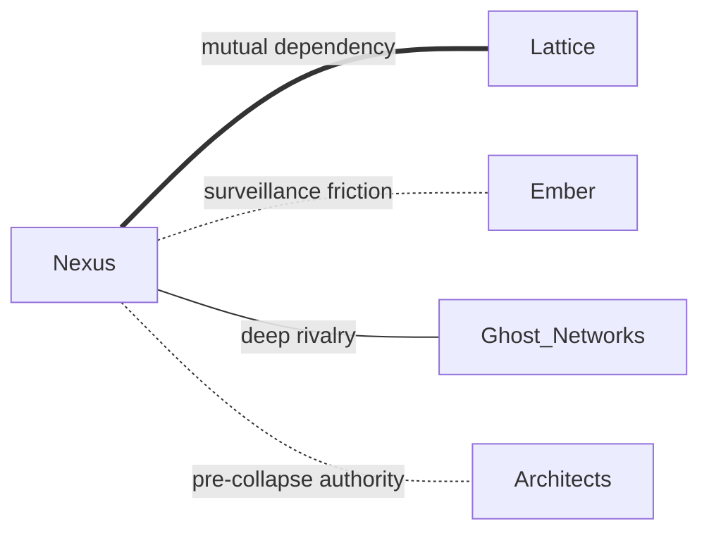

# Nexus

> [!abstract] Core Philosophy
> **Assistance through integration.** Information is survival. Connection is strength.

---

## Overview

Nexus doesn't hold territory—they hold **information**. Where there's infrastructure, Nexus is watching. Their presence is felt everywhere through surveillance networks, information brokers, and predictive systems that know what's coming before it arrives.

They emerged from the remnants of intelligence agencies and tech companies who understood that data would be the most valuable currency in the post-Collapse world.

---

## Presence

Unlike other factions, Nexus operates as a **zone of influence**, never a hard border.

- **Surveillance networks** in urban ruins
- **Information brokers** in every major settlement
- **Predictive systems** that anticipate events before they occur

### Primary Influence

- [[Northeast Scar]] — Blanket surveillance across the Boston-DC corridor

### Contested Areas

- [[Northeast Scar]] — With [[Architects]] over old government facilities

---

## Philosophy

> [!quote] Nexus Principle
> "Knowledge shared freely becomes power distributed fairly."

**Legitimate fear:** Chaos from information asymmetry
**Catastrophic blind spot:** Surveillance becomes control; assistance becomes dependency

### What They Get Right

- Information transparency prevents manipulation
- Early warning systems save lives
- Connection enables coordination

### Where They Go Wrong

- Watching everything means trusting no one
- "For your protection" becomes indistinguishable from "for our control"
- Omniscience breeds arrogance

---

## Relations

| Faction | Standing | Notes |
|---------|----------|-------|
| [[Architects]] | Contested | Both claim the [[Northeast Scar]]; mutual distrust over information access |
| [[Ghost Networks]] | Hostile | Fundamentally opposed; Nexus watches, Ghosts hide |
| [[Steel Syndicate]] | Wary | Information vs resource control; occasional trades |
| [[Witnesses]] | Respectful | Both value records; different philosophies on intervention |

---

## Notable Elements

- **Predictive algorithms** that model human behavior
- **Dead drop networks** for anonymous information exchange
- **Archive nodes** preserving pre-Collapse data

---

## Story Hooks

- A Nexus broker offers information that seems too good to be true
- Someone is feeding false data into Nexus networks
- A surveillance system witnesses something it shouldn't have

---

## See Also

- [[Factions]] — Overview of all eleven factions
- [[Northeast Scar]] — Primary area of influence
- [[Ghost Networks]] — Philosophical opposite
