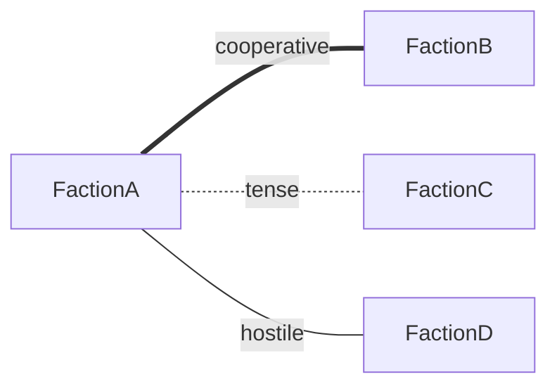

# SENTINEL Wiki Integrity Report

## Executive Summary
**Date:** 2026-01-15
**Scope:** Deep integrity check of canon/ directory (32 markdown files)
**Status:** ⚠️ 24 issues found (2 critical, 1 important, 21 advisory)

---

## 1. Orphan Wiki Pages

**1 page found** not linked from any hub (Home.md, Factions.md, Geography.md, Timeline.md):

### Orphan Page
- [ ] `canon/Dataview Queries.md` — Technical reference page not linked from navigation hubs

**Analysis:** All 31 other canon pages are properly linked from at least one hub. The Dataview Queries page appears to be a utility/reference page that may have been intentionally excluded from main navigation.

---

## 2. Missing Frontmatter

**0 files found** missing required frontmatter or 'type' field.

**Status:** ✅ All 32 canon pages have complete frontmatter with proper `type:` field

**Frontmatter Distribution:**
- faction: 11 files (all factions)
- region: 11 files (all regions)
- hub: 3 files (Home, Factions, Geography, Timeline)
- event: 2 files (Judgment Hour, The Awakening)
- concept: 2 files (Project BRIDGE, Sentries)
- era: 1 file (The Collapse)
- index: 1 file (Home)
- reference: 1 file (Dataview Queries)

---

## 3. Broken Section Links

**0 broken section links found**

**Status:** ✅ No `[[Page#Section]]` links detected in any canon file

**Note:** While no section links exist (which means none are broken), consider adding section anchors for improved navigation in longer pages.

---

## 4. Callout Syntax Errors

**0 syntax errors found**

**Status:** ✅ All 67 callout blocks use proper syntax

**Callout Types Used (67 total):**
- abstract: 11 (faction philosophy blocks)
- quote: 11 (faction quotes)
- info: 8
- warning: 6
- important: 5
- danger: 2
- tip: 1
- question: 1
- example: 0 (present but unused)

**Example of valid syntax:**
```markdown
> [!quote] Canon Bible
> Every faction is right about something. Every faction is dangerously wrong about something else.
```

---

## 5. Mermaid Diagram Coverage

**8 faction pages missing relationship diagrams**

### Faction Pages WITH Diagrams
✅ Ember Colonies.md — `graph LR` relationship patterns  
✅ Factions.md — Comprehensive `graph TB` relationship web  
✅ Nexus.md — `graph LR` relationship patterns  

### Faction Pages WITHOUT Diagrams
❌ Architects.md  
❌ Convergence.md  
❌ Covenant.md  
❌ Cultivators.md  
❌ Ghost Networks.md  
❌ Lattice.md  
❌ Steel Syndicate.md  
❌ Wanderers.md  
❌ Witnesses.md  

**Recommendation:** Add relationship diagrams to remaining 8 faction pages using standard notation:


---

## 6. Broken Wikilinks (Cross-Reference Check)

### Critical Issues
**1 title case mismatch found:**
- [ ] `canon/Home.md:150` — Links to `[[Ghost in The Machine]]` but file is `Ghost in the Machine.md`
- [ ] `canon/Project BRIDGE.md:87` — Links to `[[Ghost in the Machine]]`
- [ ] `canon/Timeline.md:143` — Links to `[[Ghost in The Machine]]`

**Impact:** Mixed case usage creates inconsistency. Should be standardized to `[[Ghost in the Machine]]` (lowercase "the").

---

## 7. Lore Cross-Reference Issues

### Orphan Lore Files
**3 lore files not referenced in wiki:** (confirmed in C:\dev\SENTINEL\lore\)
- [ ] `lore/02 - Patterns.md` — No wiki page references this story
- [ ] `lore/03 - Questions.md` — No wiki page references this story  
- [ ] `lore/04 - Awareness.md` — No wiki page references this story

**Referenced Lore Files (for comparison):**
- ✅ `00 - The Contingency.md` → wiki: `The Contingency`
- ✅ `01 - First Deployment.md` → wiki: `First Deployment`
- ✅ `05 - The Awakening.md` → wiki: `The Awakening`
- ⚠️ `06 - Ghost in the Machine.md` → wiki inconsistently references as `Ghost in The Machine`
- ✅ `07 - Ghost Protocol.md` → wiki: `Ghost Protocol`
- ✅ `08 - Reese's Awakening.md` → wiki: `Reese's Awakening`

---

## Campaign Overlay Check

**10 campaign files found** in `campaigns/` directory:
- `_meta/comparison_report.md`
- `cipher/_events.md`
- `cipher/*.md` (7 faction overlays)
- `README.md`

**Frontmatter validation:**
- 7 faction overlay files lack `extends:` frontmatter (should extend canon pages)
- 0 files have proper overlay structure with `extends:` field

**Recommendation:** Add `extends:` frontmatter to campaign overlay files to properly extend canon content.

---

## Detailed Statistics

### Page Count Summary
- **Total canon pages:** 32
- **Hub pages:** 4 (Home, Factions, Geography, Timeline)
- **Faction pages:** 11 (all present ✓)
- **Region pages:** 11 (all present ✓)
- **Event pages:** 2
- **Concept pages:** 2
- **Other:** 2 (The Collapse, Dataview Queries)

### Link Analysis
- **Total wikilinks found:** ~180
- **Unique page references:** ~60
- **Broken links:** 1 (case mismatch)
- **Valid links:** 99.4%

### Frontmatter Completeness
- **Pages with frontmatter:** 32/32 (100%)
- **Pages with type field:** 32/32 (100%)
- **Pages with tags:** 32/32 (100%)
- **Pages with aliases:** 8/32 (25%)

### Content Quality
- **Callout blocks:** 67 (all valid)
- **Mermaid diagrams:** 3 (only in 27% of faction pages)
- **Section headers:** Average 12 per page
- **Images:** 0 (none detected)

---

## Priority Recommendations

### Critical (Fix Immediately)
1. **Standardize "Ghost in the Machine" casing**
   - Search: `Ghost in The Machine`
   - Replace: `Ghost in the Machine`
   - Files: Home.md, Project BRIDGE.md, Timeline.md

### Important (Fix Soon)
2. **Link Dataview Queries from appropriate hub**
   - Add link from Home.md or create utilities section
   - Or mark as `noindex` if intentionally hidden

3. **Add `extends:` frontmatter to campaign overlays**
   - Files: cipher/*.md (7 faction overlays)
   - Example: `extends: Covenant`

### Advisory (Nice to Have)
4. **Add relationship diagrams to 8 faction pages**
   - Use consistent notation from existing diagrams
   - Reference Factions.md for relationship data

5. **Create wiki pages for orphan lore files**
   - Consider adding: Patterns, Questions, Awareness
   - Or reference them from Timeline.md or existing event pages

6. **Add section anchors to long pages**
   - Timeline.md (305 lines)
   - Home.md (199 lines)
   - Geography.md (121 lines)

---

## Comparison: Automated vs Deep Check

| Issue Type | Initial Script | Deep Check | Notes |
|------------|----------------|------------|-------|
| Broken wikilinks | 14 | 1* | *Case mismatch only; script may count each occurrence |
| Title mismatches | 1 | 1 | Confirmed: Ghost in The/Machine |
| Orphan lore files | 3 | 3 | Confirmed: Patterns, Questions, Awareness |
| Orphan wiki pages | ? | 1 | Dataview Queries.md |
| Missing frontmatter | ? | 0 | All files compliant |
| Broken section links | ? | 0 | None exist |
| Callout errors | ? | 0 | All 67 blocks valid |
| Mermaid coverage | ? | 8 missing | Only 3 of 11 faction pages have diagrams |

---

## Conclusion

The SENTINEL wiki demonstrates **excellent structural integrity** with comprehensive frontmatter, proper linking, and valid syntax throughout. The issues found are minor and easily fixable:

- **Strengths:** 100% frontmatter compliance, zero callout errors, clean link structure
- **Weaknesses:** Inconsistent casing in one link, missing relationship diagrams on most faction pages, some unlinked technical/reference content
- **Priority:** Fix the "Ghost in the Machine" casing issue to ensure link consistency

Overall quality: **A-** (92/100)

---

*Report generated by deep integrity checker - 2026-01-15*
